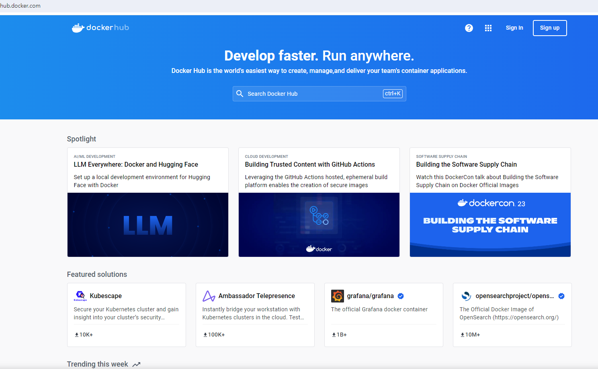
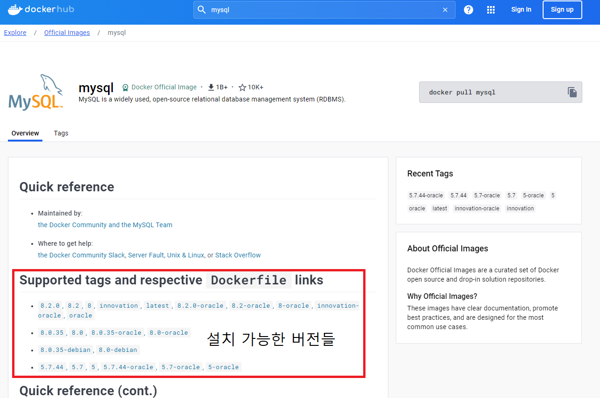
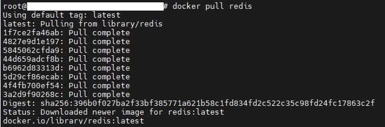
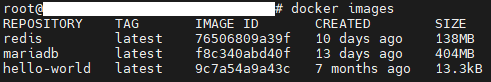
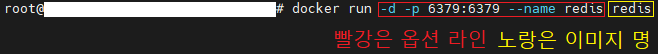
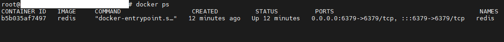
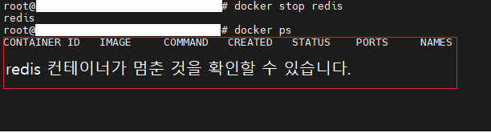
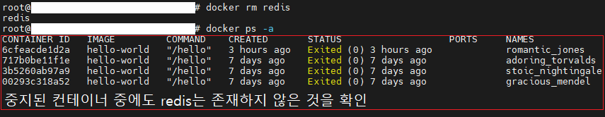

# Ubuntu 서버에 Docker 설치

 <b>Docker란 무엇이고 왜 사용하는 건가요?</b> 
 

Docker란 컨테이너 기반 오픈 소스 가상화 플랫폼 입니다. 

아주 예전에는 한 서버, 하나의 물리적인 시스템에는 하나의 서비스만을 제공할 수 있었습니다. 
그러나 매우 간단한 서비스를 제공해야한다면 CPU 사용률, 자원의 사용률에 낭비가 발생합니다. 

돈을 많이 들여 서버를 장만했는데 "Hello World" 딱 하나 보여주는 웹 사이트용으로만 사용하면 매우 낭비지 않겠나요? 

이를 해결하기 위해 하나의 물리적 시스템이 여러 OS를 실행할 수 있는 가상 머신(VM)이 나오게 됩니다. 
하지만 VM의 경우 호스트 OS 위에 가상화된 OS를 실행하는 방식입니다. 
각 OS들이 완벽히 분리할 수 있는 장점이 있지만 무겁고 느리다는 단점이 존재합니다. 

만약 VM을 쓸 필요까진 없을 정도의 가벼운 실행을 원한다면 VM은 적합하지 않을겁니다.

### 그래서 나온 것이 컨테이너(container)를 실행하고 관리하는 오픈 소스 가상화 플랫폼 Docker 입니다.

컨테이너란 격리된 환경의 코드를 뜻합니다. 컨테이너는 여러분의 OS와 파일 등에 대해 전혀 알지 못합니다. 
VM의 경우 OS가 완전 분리되지만 컨테이너는 호스트 OS의 커널을 공유하고 있어 내부적 통신이 쉽습니다. 
컨테이너는 Docke 위에 어플리케이션 실행을 위한 이미지(image)만이 올라가 VM보다 가볍습니다. 

여기서 이미지는 컨테이너를 실행할 수 있는 파일과 설정 모음을 뜻합니다. 
만약 MySQL 이미지를 한 컨테이너에 넣고 다른 컨테이너에 SpringBoot를 넣었다면 각각의 컨테이너는 SpringBoot, Mysql로 동작하게 됩니다. 

위는 아주 간략히 정리한 내용이고, 좀 더 정확하고 확실한 설명은 다음 링크들을 참고하는 것이 가장 좋습니다! 

https://docs.docker.com/guides/get-started/ 
https://www.ibm.com/kr-ko/topics/docker 
https://aws.amazon.com/ko/docker/ 

### Docker 설치

    Docker를 설치해보도록 합시다.
    
    ubuntu 기준으로는 아래에 공식사이트에서 실행시켜야할 명령들을 제공합니다.
    https://docs.docker.com/engine/install/ubuntu/

    1. 먼저 도커 레포지터리를 세팅해야합니다. 이유는 추후 docker install, update를 레포지터리에서 수행 가능하게 되기 때문이라고 합니다.

    아래의 명령들을 위에서부터 차례대로 수행해줍니다.

    # Add Docker's official GPG key (아래는 도커 공식 GPG key 추가하는 코드들):
    sudo apt-get update
    sudo apt-get install ca-certificates curl gnupg
    sudo install -m 0755 -d /etc/apt/keyrings
    curl -fsSL https://download.docker.com/linux/ubuntu/gpg | sudo gpg --dearmor -o /etc/apt/keyrings/docker.gpg
    sudo chmod a+r /etc/apt/keyrings/docker.gpg

    # Add the repository to Apt sources (레포지터리를 apt 소스에 추가하는 코드들):
    echo \
    "deb [arch=$(dpkg --print-architecture) signed-by=/etc/apt/keyrings/docker.gpg] https://download.docker.com/linux/ubuntu \
    $(. /etc/os-release && echo "$VERSION_CODENAME") stable" | \
    sudo tee /etc/apt/sources.list.d/docker.list > /dev/null
    sudo apt-get update

    2. docker pakage를 install합니다.
    
    sudo apt-get install docker-ce docker-ce-cli containerd.io docker-buildx-plugin docker-compose-plugin

    3. docker engine이 제대로 설치되었는지 hello-world 이미지를 실행하여 확인해봅니다.

    sudo docker run hello-world

정상적으로 설치하고 3번을 수행하면 결과는 다음과 같습니다.  
 

### Docker Image 검색
docker는 여러 이미지들을 지원하고 있고 이미지마다 버전이 존재합니다. 
어떤 이미지를 제공하고 어떤 버전이 있는지는 Dockerhub 사이트에서 검색이 가능합니다. 

https://hub.docker.com/

 <b> 도커 허브 페이지 화면</b> 

메인 페이지 
 

검색 결과 
 

상세 내용 및 설치 가능한 버전 
 

### Docker 주요 명령어

docker pull {설치할 이미지 이름}으로 최신 버전의 이미지를 설치할 수 있습니다. 
만약 특정 버전의 이미지를 설치하려면 docker pull {이미지 이름:버전} 으로 설치가 가능합니다. 

 

docker images : Docker에 현재 설치된 이미지들을 조회할 수 있습니다. 

 

docker run {옵션} {이미지} : 컨테이너를 실행하는 명령어 옵션에서 컨테이너 이름, 포트 번호 등을 설정 가능.

예시로 redis를 docker run을 하면 다음과 같습니다. 

 
Docker run은 여러 옵션이 있고 여기서 사용된 옵션은 -d, -p, --name입니다. 
-d : 백그라운드에서 실행하라 
-p : 이 컨테이너의 포트 번호는 { 호스트의 포트 (외부 포트) : 컨테이너의 내부 포트 } 각각 6379이다. 
--name : 이 컨테이너의 이름은 "redis"이다.  

docker ps {옵션} : 현재 존재하는 컨테이너들의 정보를 조회할 수 있는 명령어 

 

docker stop {컨테이너 id 혹은 컨테이너 이름} : 실행중인 컨테이너를 멈춥니다. 

 

docker rm {옵션} {컨테이너 ID 혹은 컨테이너 이름} : 컨테이너를 삭제하는 명령어 

