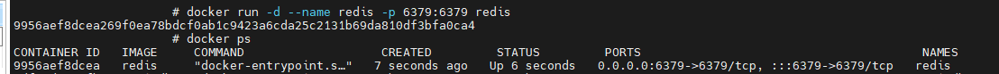
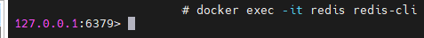
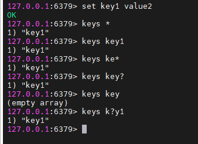
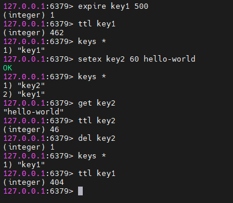

# Docker에 Redis 설치

#### Redis란 오픈소스의 인메모리 데이터 구조 스토어 입니다.

Redis는 REmote DIctionary(Key-Value 형태의 구조) Server의 약자로 in-memory data structure store 입니다.<br>

Redis는 기본적으로 Key-Value형태로 데이터를 저장, 읽는 기능을 제공하고 문자열, 해시, 리스트, 세트 등의 다양한 데이터 구조도 지원합니다.<br>
거기다 in-memory 즉 데이터를 주 메모리에 저장하기 때문에 저장, 탐색 등의 동작이 매우 빠릅니다.<br>

Redis는 데이터 영속성을 제공합니다. 휘발성으로 데이터가 사라지는 것이 아닌 데이터를 남겨둘 수 있고 데이터가 얼마간 남아있을지 지속 기간도 설정해줄 수 있습니다.<br>

이러한 특징들로 인해 Redis는 데이터베이스, 캐쉬, 메시지 브로커(message broker), 스트리밍 엔진 등으로 유용하게 쓸 수 있습니다.<br>

더욱 자세한 설명, 설치, 튜토리얼 등은 Redis 공식 사이트를 참조해주세요.<br>
https://redis.io/docs/about/


### Redis를 Docker에 설치하는 이유

Redis를 Docker에 설치하게 되면 다음과 같은 장점을 가지게 되어 저는 Docker에 설치합니다.
1. 독립성을 가지게 되어 호스트 시스템의 환경이나 다른 구성 요소에 영향을 덜 주며 실행 가능하다.
2. 쉽게 배포할 수 있고 Docker로 쉽게 컨테이너를 관리할 수 있다.

위의 두 가지 이유로 MSA나 여러 어플리케이션이 필요한 프로젝트를 진행할 경우 Docker를 통해 Redis를 설치가 더욱 적절합니다.

단점으로는 Docker는 가상화 기술을 사용하기 때문에 성능 오버헤드가 발생할 수도 있습니다.<br>
다만 성능의 차이가 미미하다고 판단되었기 때문에 쉽게 관리할 수 있는 Docker를 선호하게 되었습니다.


### Docker에 Redis image 설치

Redis image를 설치합니다.
```
docker pull redis
```

image가 설치되면 컨테이너를 생성하고 실행해줍니다. (참고로 기본 포트는 6379입니다.)
```
docker run -d --name "컨테이너 이름" -p 6379:6379 redis
```

<br><br>


설치한 Redis의 CLI에 연결하기

```
docker exec -it "레디스 컨테이너 이름" redis-cli
```

다음과 같은 결과가 나온다면 성공적으로 설치가 완료되었습니다.<br>

<br>

CLI에서 나오려면 Ctrl + C 를 누르면 Redis CLI에서 나올 수 있습니다.

### Redis CLI 명령어

#### key - value 데이터 저장하기

```
set [키 이름] [값]
```

#### 등록된 키 값 조회하기
```
keys [패턴 값]
```
특정 문자열(패턴)을 포함한 키 값을 조회 합니다.<br>
'*' 과 '?'를 이용해서 부분 문자 포함, 전체 문자 포함 등을 나타낼 수 있습니다.

<br>

#### 이미 있는 키 값에 만료 시간 정하기
```
expire [키 이름] [만료 시간 (초 단위)]
```

#### 만료 시간을 설정하면서 데이터를 저장하기
```
setex [키 이름] [만료 시간 (초 단위)] [값]
```

#### 키를 통해서 저장된 값을 불러오기
```
get [키 이름]
```

#### 소멸까지 남은 시간 불러오기
```
ttl [키 이름]
```

#### 키 삭제하기
```
del [키 이름]
```
<br>

<br>