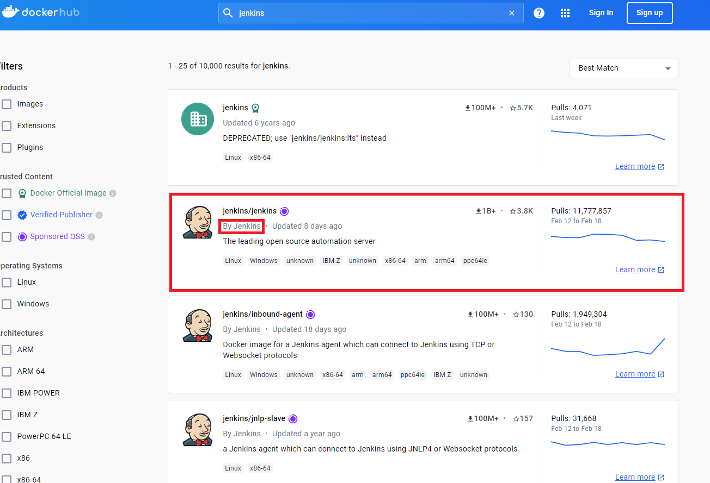
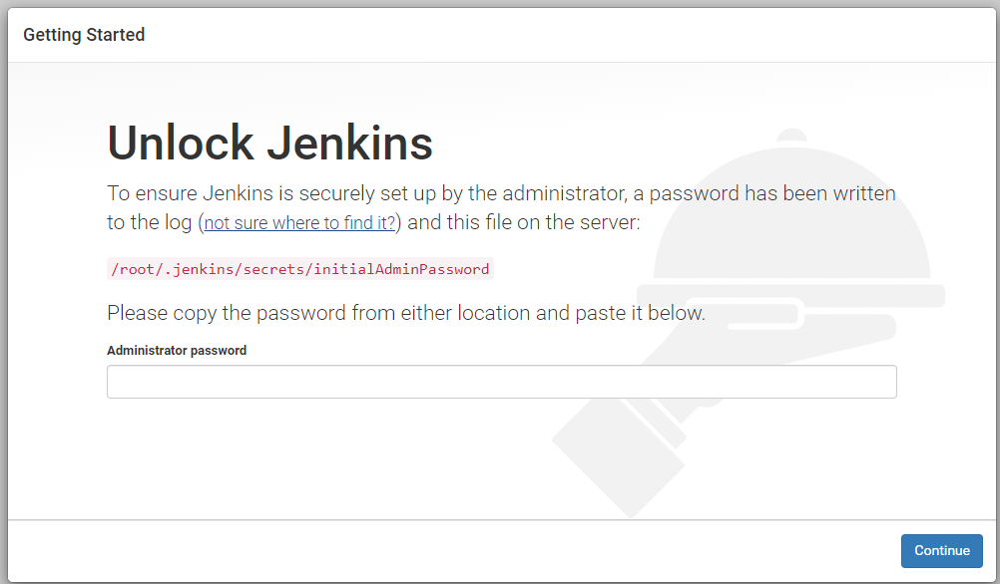

# Docker에 Jenkins 설치

### Docker에 Jenkins image 설치

Jenkins의 개념은 [기본 Jenkins 설치](../../../Jenkins/README.md)의 개념부분을 읽어주세요

<br>

DockerHub에서 jenkins를 검색하면 공식 Jenkins에서 올린 도커 이미지 jenkins/jenkins가 있습니다.<br>
또한 아래의 공식 github 문서에서 docker 실행 및 설정 등이 나와있어서 참고하실 수 있습니다.
https://github.com/jenkinsci/docker/blob/master/README.md<br>

이제 위의 이미지를 pull 하겠습니다.
```
sudo docker pull jenkins/jenkins
```

다음으로 docker에서 실행합니다. (아래는 jdk17 기준입니다.)

```
sudo docker run --name jenkins -p 8080:8080 -p 50000:50000 --restart=on-failure -v jenkins_home:/var/jenkins_home jenkins/jenkins:lts-jdk17
```

-v는 docker 내부의 /var/jenkins_home의 디렉토리를 호스트의 볼륨으로 마운트하는 것 입니다.
즉 호스트의 jenkins_home 디렉토리 내에서 설정을 수정할 수 있습니다.

이제 호스트ip:8080포트로 접속하게 되면 최초의 화면이 나올 것 입니다.

----
혹시 prefix를 부여하고 싶으시면 아래의 옵션을 docker run 하실 때 포함하면 됩니다.

```
-e JENKINS_OPTS="--prefix=/[원하는 문구]"
```
---
<br>
<br>

docker에서 -d로 실행한 컨테이너의 로그를 출력하는 방법은 다음 명령어를 수행하시면 됩니다.
```
sudo docker logs jenkins
```

이러면 최초 비밀번호가 로그로 존재합니다. 혹은 도커 볼륨 jenkins_home에서 /secrets를 찾을 수 있습니다.

이렇게 하면 설치가 완료되고 이후의 설정은 기존 Jenkins와 동일하게 사용하시면 됩니다.