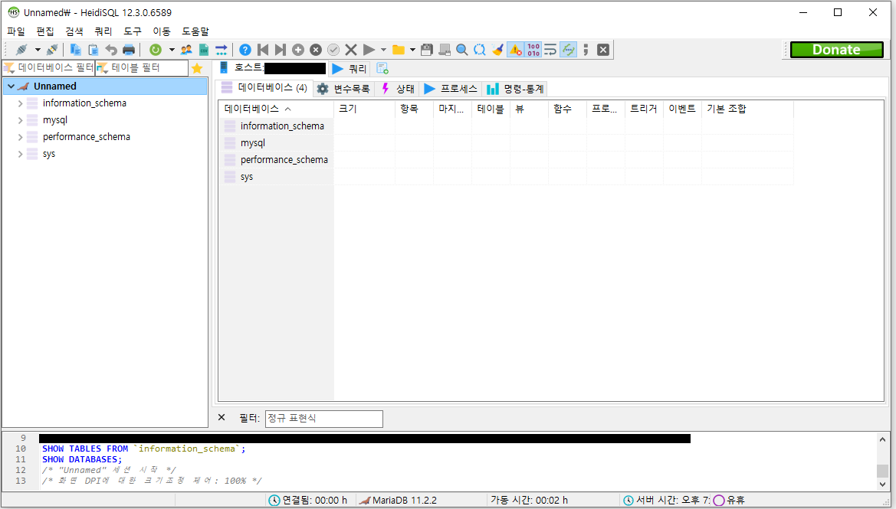

# Docker에 MariaDB 설치

<details>
<summary> <b>MariaDB란 무엇일까요?</b> </summary><br>

#### MariaDB란 MariaDB는 "MySQL"에서 Fork(분기, 분파)한 오픈소스 기반 관계형 데이터 베이스 관리 시스템 (RDBMS) 입니다.<br>
MySQL은 1995년에 릴리즈된 오픈소스 RDBMS입니다. 매우 인기가 많은 RDBMS로 현재도 여러 환경에서 이용되고 있는 대표적인 RDBMS입니다.<br>
MySQL은 2009년에 최종적으로 OracleDB로 유명한 Oracle에 인수되게 됩니다.<br>
이 과정에서 라이선스 관련한 분쟁이 일어났고 이에 반발한 MySQL의 창시자가 2009년에 완성된 MySQL 5.1.38의 버전의 코드에서 Fork하여 만든 것이 MariaDB입니다.<br>

#### 쉽게 말해서 MaraiDB는 MySQL이라는 조상에서 분파된 RDBMS입니다.

( 이건 기억을 더듬어 쓰는 것이기 때문에 확실하진 않은 이야기로만 들어주세요. 제가 인턴 때 강사에게 들었던 얘기로는 Oracle이 당시 MySQl을 인수하고 있었던 썬이라는 기업(JAVA를 만든걸로 유명하죠)을 합병할 때 MySQL 업데이트를 반드시 책임져야하는 조건이 붙게 되었다고 합니다. 그런데 Oracle입장에서는 자신들의 DB만으로도 충분한데 굳이 MySQL까지 담당해야하는것이 여간 껄그러운 일이 아닐 수 없었다고 합니다. 그래서 합병 과정 중 여러 충돌이 발생하게 되다보니 MySQL을 개발하던 많은 개발자들이 이탈하여 MariaDB를 만들게 되었다고 합니다. )

저는 개인 프로젝트 이용 시 학부시절엔 MySQL을 사용하다가 현재는 MariaDB를 더욱 사용하고 있습니다. MariaDB를 이용하는 이유는 다음과 같습니다.<br>
1. MySQL을 개선한 RDBMS로 MySQL보다 복제 및 쿼리 속도 등의 성능이 약간 더 좋다.
2. MySQL에서 Fork한 RDBMS이기 때문에 MySQL과의 호환성이 매우 뛰어나다.
3. 오픈소스 기반 RDBMS이기 때문에 자유롭게 사용이 가능하다.
4. 업데이트가 MySQL보다 더욱 활발하다.
   
위의 사항 외에도 보안성이 더 좋고 스토리지 엔진이 더욱 뛰어나다는 장점도 존재합니다.<br>

더욱 자세한 설명은 아래의 링크들에서 확인할 수 있습니다.

https://aws.amazon.com/ko/compare/the-difference-between-mariadb-vs-mysql/<br>
https://linuxnatives.net/2015/10-reasons-to-migrate-to-mariadb-if-still-using-mysql

</details>

### Docker에 MariaDB image 설치

먼저 MariaDB image를 설치합니다.
```
docker pull mariadb
```
<br>

이제 MariaDB 컨테이너를 실행시켜줍니다.
```
docker run -d --name [컨테이너 이름] -p [외부포트:내부포트] --env MARIADB_ROOT_PASSWORD=[root계정 비밀번호 입력] --restart=always  mariadb
```

<br>

이제 MariaDB가 모두 설치되어 DB로서 사용할 수 있습니다.<br>

작업용 데스크탑(windows)에서 MariaDB의 기본 GUI인 HeidiSQL을 통해 ubunut 서버의 mariaDB에 접속할 수 있는 것을 확인할 수 있습니다.<br>

<br>
<br>