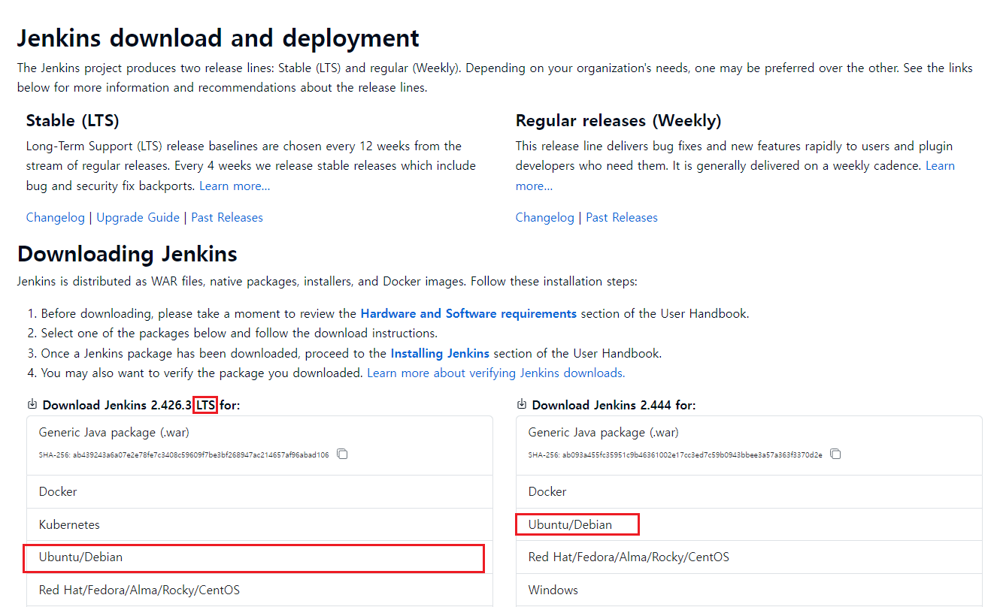
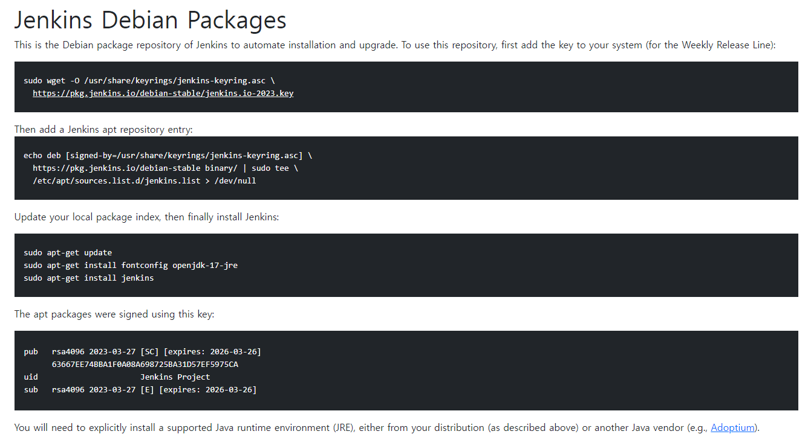
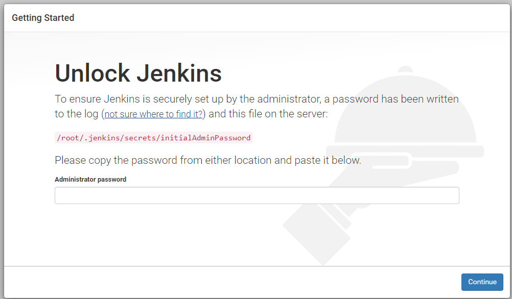
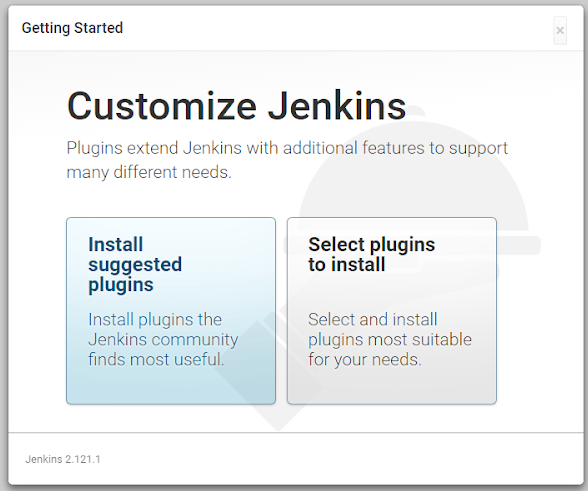

# Ubuntu 서버에 Jenkins 설치

## 해당 README는 아직 완성되지 않은 상태입니다!!

<details>
<summary> <b>Jenkins란 무엇이고 왜 사용하는 건가요?</b> </summary>
Jenkins는 소프트웨어 개발 프로세스에서 CI/CD 즉 지속적 통합(Continuous Integration) 및 지속적 배포(Continuous Deployment)를 지원하기 위한 오픈 소스 자동화 도구입니다.<br>
개발한 프로그램의 빌드, 테스트, 패키지화, 배포 단계를 자동화하여 개발된 코드의 빠른 적용, 효과적 관리를 할 수 있도록 도와줍니다.

즉 Jenkins는 개발자들이 소프트웨어를 더 신속하게 제공하고 품질을 유지하며 프로세스를 자동화하는 데 도움을 줍니다.
</details>

### Jenkins 설치 방법

아래의 Jenkins 공식 홈페이지에서 자신에 맞는 패키지를 선택하여 다운하면 됩니다.<br>
https://www.jenkins.io/download/<br>
저는 Ubuntu를 쓰기 때문에 Ubuntu로 선택합니다.

** LTS는 Long-Term Support로 업데이트가 자주 일어나지 않으나 안전성이 보장된 버전이라는 뜻입니다.

<br>

그러면 다음과 같이 화면이 나오는데 여기서 설명하는 명령어를 입력하면 됩니다.

<br>

자동 설치와 업그레이드를 위한 레포지토리를 사용하기 위해 서명 키를 추가해줍니다.
```
  sudo wget -O /usr/share/keyrings/jenkins-keyring.asc \
    https://pkg.jenkins.io/debian-stable/jenkins.io-2023.key
```

apt에 레포지토리를 추가해줍니다.
```
  echo deb [signed-by=/usr/share/keyrings/jenkins-keyring.asc] \
    https://pkg.jenkins.io/debian-stable binary/ | sudo tee \
    /etc/apt/sources.list.d/jenkins.list > /dev/null
```

Jenkins를 설치합니다.
```
sudo apt-get update
  sudo apt-get install fontconfig openjdk-17-jre
  sudo apt-get install jenkins
```

apt Packages는 다음과 같은 키로 서명되어있다고 합니다.
```
pub   rsa4096 2023-03-27 [SC] [expires: 2026-03-26]
      63667EE74BBA1F0A08A698725BA31D57EF5975CA
uid                      Jenkins Project 
sub   rsa4096 2023-03-27 [E] [expires: 2026-03-26]
```

### Jenkins 설치 후

최초 설치 이후에는 다음과 같이 로그가 나올 것 입니다.

```
*************************************************************
*************************************************************
*************************************************************

Jenkins initial setup is required. An admin user has been created and a password generated.
Please use the following password to proceed to installation:

#### 여러분들의 최초 패스워드 값 ####

This may also be found at: #### 여러분들의 jenkins/secrets/initialAdminPassword 디렉토리 위치 ####

*************************************************************
*************************************************************
*************************************************************

```

기본 포트는 8080으로 되어있는데 호스트ip:8080으로 브라우저에 검색하면 다음 화면이 나오게 됩니다.<br>



여기서 로그에 나왔던 최초 패스워드 값을 입력하시고 혹시 로그가 지워졌다면<br>
jenkins의 설정이 있는 디렉토리에서 /secrets 디렉토리에 initialAdminPassword 파일을 열면 거기에 적혀있습니다.

비밀번호 입력 후 추천 플러그인 설치와 사용자 지정 선택지가 주어지는데 왼쪽의 추천을 선택하면 됩니다.<br>


이후 설치가 진행되고 설치 이후 관리자 계정을 만들어주시고 혹시 특별한 Jenkins URL을 설정하실 것이면 Jenkins URL도 적어주시면 설치가 완료됩니다.

### Jenkins 포트 번호 변경 방법
Jenkins는 기본 8080 포트를 이용하고 있는데 이는 다른 프로그램에서도 자주 사용되는 포트이기 때문에
충돌 방지를 위해 포트를 미리 잘 사용하지 않는 번호로 변경해두면 좋습니다.

포트를 가령 123456789로 바꾼다는 가정으로 바꾸는 방법을 소개하겠습니다.<br>
Jenkins의 포트 번호를 변경하기 위해서는 아래의 명령어를 통해서 Jenkins의 설정 파일을 직접 수정해야합니다.

```
sudo vim /etc/sysconfig/jenkins
```

파일 안에 JENKINS_PORT="8080"으로 적힌 부분이 있는데 여기서 8080을 123456789로 바꾸면 됩니다.

#### Jenkins 포트 번호를 변경해도 적용이 되지 않는다면?

저 같은 경우 처음 Jenkins의 포트를 변경해도여전히 8080포트에 실행이 되는 일을 겪은 적이 있습니다.<br>
찾아본 결과 그 문제는 우선순위가 더 높은 다른 설정 파일이 있다는 점 이었습니다.<br>
보통은 위의 변경 방법으로 해결이 된다고 하는데 안되는 분들은 아래의 방법을 참고해주세요.<br>

다음 명령어를 실행합니다.
```
vim /usr/lib/systemd/system/jenkins.service
```

파일 안에 Environment="JENKINS_PORT=8080" 부분의 8080을 123456789로 바꾸면 됩니다.


이후 다음 명령어로 Jenkins를 다시 실행해주면 Port가 변경되었음을 확인할 수 있습니다.
```
sudo systemctl restart jenkins
```
