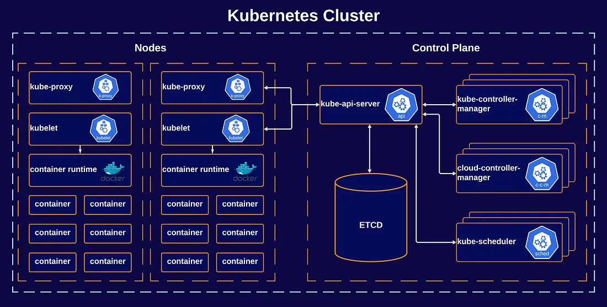
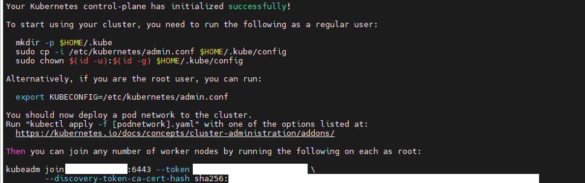
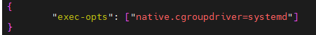

# Ubuntu 서버에 Kubernetes 설치


<details>
<summary> <b>Kubernetes(k8s)란 무엇이고 왜 사용하는 건가요?</b> </summary><br>

!!!! 쿠버네티스를 이해하기 전에 먼저 컨테이너 환경에 대해 이해가 필요합니다.<br>
컨테이너, Docker에 대해 모르신다면 [여기를 클릭하여 Docker 개념을 확인해주세요.](../Docker/README.md) !!!!


쿠버네티스는 컨테이너화된 애플리케이션을 자동으로 배포, 스케일링 및 관리해주는 오픈소스 시스템입니다.


컨테이너화 된 애플리케이션이 정말 많다고 가정했을 때 이들을 일일히 관리해야하면 얼마나 불편할까요?<br>
예로 만약 수많은 컨테이너 중 어떤 컨테이너가 다운되어서 이를 해결하기 위해 다른 컨테이너를 다시 시작해야하는 문제가 발생했을 때 직접 이 문제를 파악하고 처리하는 것보다 시스템이 처리해준다면 훨씬 수월하지 않을까요?

쿠버네티스 공식 사이트에서는 위와 같은 이유로 쿠버네티스가 필요하다고 합니다!<br>
많은 컨테이너들을 자동으로 배포, 확장, 관리하는 프로세스를 컨테이너 오케스트레이션이라고 부르며 k8s는 대표적인 컨테이너 오케스트레이션 툴입니다

쿠버네티스는 다음과 같은 기능들을 제공하면서 더욱 탄력적이게 분산 시스템을 실행할 수 있게 도와줍니다.<br>

- <b>서비스 디스커버리와 로드 밸런싱</b> 쿠버네티스는 DNS 이름을 사용하거나 자체 IP 주소를 사용하여 컨테이너를 노출할 수 있다. 컨테이너에 대한 트래픽이 많으면, 쿠버네티스는 네트워크 트래픽을 로드밸런싱하고 배포하여 배포가 안정적으로 이루어질 수 있다.
  
- <b>스토리지 오케스트레이션</b> 쿠버네티스를 사용하면 로컬 저장소, 공용 클라우드 공급자 등과 같이 원하는 저장소 시스템을 자동으로 탑재할 수 있다
  
- <b>자동화된 롤아웃과 롤백</b> 쿠버네티스를 사용하여 배포된 컨테이너의 원하는 상태를 서술할 수 있으며 현재 상태를 원하는 상태로 설정한 속도에 따라 변경할 수 있다. 예를 들어 쿠버네티스를 자동화해서 배포용 새 컨테이너를 만들고, 기존 컨테이너를 제거하고, 모든 리소스를 새 컨테이너에 적용할 수 있다.
  
- <b>자동화된 빈 패킹(bin packing)</b> 컨테이너화된 작업을 실행하는데 사용할 수 있는 쿠버네티스 클러스터 노드를 제공한다. 각 컨테이너가 필요로 하는 CPU와 메모리(RAM)를 쿠버네티스에게 지시한다. 쿠버네티스는 컨테이너를 노드에 맞추어서 리소스를 가장 잘 사용할 수 있도록 해준다.
  
- <b>자동화된 복구(self-healing)</b> 쿠버네티스는 실패한 컨테이너를 다시 시작하고, 컨테이너를 교체하며, '사용자 정의 상태 검사'에 응답하지 않는 컨테이너를 죽이고, 서비스 준비가 끝날 때까지 그러한 과정을 클라이언트에 보여주지 않는다.
  
- <b>시크릿과 구성 관리</b> 쿠버네티스를 사용하면 암호, OAuth 토큰 및 SSH 키와 같은 중요한 정보를 저장하고 관리할 수 있다. 컨테이너 이미지를 재구성하지 않고 스택 구성에 시크릿을 노출하지 않고도 시크릿 및 애플리케이션 구성을 배포 및 업데이트할 수 있다.


여담으로 Kubernetes를 k8s라고 부르는 이유는 'K'와 's'사이에 8문자(ubernete)가 있기 때문에 줄여서 k8s입니다.

더욱 자세한 설명은 쿠버네티스 공식 문서인 다음 사이트를 참고하시면 되겠습니다.<br>
https://kubernetes.io/ko/docs/concepts/overview/

-----
----

</details>

### Kubernetes 컴포넌트 ( 쿠버네티스의 구성 요소와 아키텍쳐 )

설명하기 앞서 쿠버네티스에서 사용되는 용어를 정리하고 가겠습니다.

#### 파드(Pod) : 하나 이상의 컨테이너로 구성된 단일 목적의 일을 하기 위해 모인 단위입니다.

#### 노드(Node) : 컨테이너 형태의 애플리케이션을 호스팅하는 물리 혹은 가상 환경의 machine을 뜻합니다.

#### 클러스터(cluster) : 최소 하나 이상의 노드들의 집합을 뜻합니다.


쿠버네티스를 배포하면 클러스터가 생성되는데 이 안에 구성요소들이 각자 역할을 수행하게 됩니다.<br>
그 아키텍처를 나타낸 것이 다음 그림입니다.



( 공식 사이트 아키텍쳐 그림보다 더 잘 나타낸 이미지를 찾아서 가져왔습니다. )

클러스터 내엔 노드들이 여러개 있고 그 중 Control Plane은 다른 노드들의 전반적인 결정을 내리고 이벤트를 감지하고 반응합니다.<br>
책에서는 Control Plane을 마스터 노드라고 부르고 다른 노드들을 워커 노드라고 정의하고 있었는데 찾아보니 2021년 경에 k8s github 업그레이드 공지사항에 master에서 Control plane으로 명칭을 바꿨다는 사실을 확인했습니다.<br>

Control Plane(마스터 노드)의 구성 요소는 다음과 같습니다.

1. kubectl : 쿠버네티스 클러스터에 명령을 내리는 역할을 수행합니다.
2. kube-apiserver : 쿠버네티스 클러스터의 중심 역할을 하는 통로입니다. 주로 etcd와 통신하고 그 외의 요소들도 api 서버를 중심으로 통신합니다.
3. etcd(엣시디) : 모든 클러스터 데이터(상태)를 기억하는 key-value 저장소입니다. 클러스터의 backing store로 이용됩니다. etcd 외에는 각 구성 요소들은 자신들의 상태 값을 관리하지 않습니다. etcd를 정보만 백업하면 긴급 장애 상황에도 쿠버네티스 클러스터를 복구할 수 있습니다.
4. kube-scheduler : 새로 생성된 파드의 자원, 요구 조건 등이 적절하게 맞는 워커노드에 지정해주는 역할을 수행합니다.
5. kube-controller-manager : 컨트롤러란 apiserver를 통해서 공유된 클러스터의 상태를 감시하고 현재 상태를 원하는 상태로 관리하는 것을 뜻하는데 컨트롤러 매니저란 이런 컨트롤러를 생성하고 관리하는 역할을 수행합니다.

Node(워커 노드) 의 구성요소는 다음과 같습니다.
1. kubelet : 클러스터의 각 노드에서 실행되는 에이전트로 파드에서 컨테이너가 확실하게 동작하도록 관리합니다.
2. kube-proxy : 각 노드의 네트워크 규칙을 유지 관리합니다. 이 네트워크 규칙이 내부 네트워크 세션이나 클러스터 바깥에서 파드로 네트워크 통신을 할 수 있도록 해줍니다.
3. 컨테이너 런타임(CRI) : 파드를 이루는 컨테이너의 실행을 담당합니다.

---
---
### Kubernetes 설치 방법

### !!!! k8s 설치 전 Docker를 먼저 설치해주세요 !!!!
[Docker 설치는 여기를 클릭하여 Docker 설치 방법 확인](../Docker/README.md)

아래의 내용들은 모두 워커 노드, 마스터 노드 동일하게 설치해주셔야합니다.<br>
설치에 앞서 기본 세팅을 해야합니다.

아래 명령어로 노드들이 swapoff가 되도록 만들어줘야 쿠버네티스에서 오류가 발생하지 않습니다.

```
sudo swapoff -a
sudo sed -i '/swap/s/^/#/' /etc/fstab
```

그리고 iptable 설정을 위한 명령어 수행

```
cat <<EOF | sudo tee /etc/modules-load.d/k8s.conf
overlay
br_netfilter
EOF

sudo modprobe overlay
sudo modprobe br_netfilter

# sysctl params required by setup, params persist across reboots
cat <<EOF | sudo tee /etc/sysctl.d/k8s.conf
net.bridge.bridge-nf-call-iptables  = 1
net.bridge.bridge-nf-call-ip6tables = 1
net.ipv4.ip_forward                 = 1
EOF

# Apply sysctl params without reboot
sudo sysctl --system
```

공식 사이트를 기준으로 설치방법을 배워보겠습니다. ( 공식 사이트에서 한글을 지원하지만 언어를 영어로 선택해야 최신버전의 글을 읽을 수 있습니다!! )<br>
https://kubernetes.io/ko/docs/tasks/tools/<br>

먼저 kubectl을 설치해야합니다. 크게 아래와 같이 3가지 방법이 있는데
1. 리눅스에서 curl을 사용하여 kubectl 바이너리 설치
2. 기본 패키지 관리 도구를 사용하여 설치
3. 다른 패키지 관리 도구를 사용하여 설치

저의 경우 1번과 2번으로 각각 설치헤본 경험이 있는데 2번 방법을 기준으로 Debian 계열의 기본 패키지인 apt를 이용한 kuberctl 설치를 설명하겠습니다.

apt 패키지 인덱스를 업데이트하고 쿠버네티스 apt 리포지터리를 사용하는 데 필요한 패키지들을 설치.
```
sudo apt-get update
sudo apt-get install -y apt-transport-https ca-certificates curl
```

구글 클라우드 공개 서명 키를 다운로드

```
curl -fsSL https://pkgs.k8s.io/core:/stable:/v1.29/deb/Release.key | sudo gpg --dearmor -o /etc/apt/keyrings/kubernetes-apt-keyring.gpg
```

쿠버네티스 apt 리포지터리를 추가한다.
```
echo 'deb [signed-by=/etc/apt/keyrings/kubernetes-apt-keyring.gpg] https://pkgs.k8s.io/core:/stable:/v1.29/deb/ /' | sudo tee /etc/apt/sources.list.d/kubernetes.list
```

새 리포지터리의 apt 패키지 인덱스를 업데이트하고 kubectl을 설치.
```
sudo apt-get update
sudo apt-get install -y kubelet kubeadm kubectl
sudo apt-mark hold kubelet kubeadm kubectl
```

이후 아래의 명령어를 수행시켜주어 etc/containerd/config.toml 의 내용을 수정해줍니다.
```
# continaerd 디렉터리가 없다면
sudo mkdir /etc/containerd

sudo sh -c "containerd config default > /etc/containerd/config.toml"
sudo sed -i 's/ SystemCgroup = false/ SystemCgroup = true/' /etc/containerd/config.toml


sudo systemctl restart containerd.service
sudo systemctl restart kubelet.service
sudo systemctl enable kubelet.service

```

----
----

### 컨트롤 플레인(마스터 노드)에서 클러스터 생성하기

쿠버네티스를 시작하려면 컨트롤 플레인에서 클러스터를 생성하고 실행해야 합니다.<br>
클러스터 실행을 위해선 도구가 필요합니다. 도구의 종류는 많지만 공식사이트에서 소개하는 3가지 도구는 다음과 같습니다.

1. kind
2. minikube
3. kubeadm

1번 kind와 2번 minikube는 각각 로컬에서 쿠버네티스 실행에 사용되는 도구입니다.<br>
특히 minikube는 단일 머신에서 쿠버네티스를 실행하여 개발 및 테스트를 하기 위한 작은 규모의 클러스터를 생성할 수 있어서 쿠버네티스 학습 시 매우 유용하다고 합니다.

kubeadm의 경우 여러 대의 머신에서 쿠버네티스 클러스터를 구성하고 운영할 수 있는 도구이며 커뮤니티에서도 가장 권장하는 도구입니다.

저희는 kubeadm을 설치하였으므로 kubeadm 기준으로 클러스터 생성을 진행해보겠습니다.

<b>마스터 노드</b>에서 kubeadm 을 실행하려면 다음 명령어를 입력하면 됩니다.

```
sudo kubeadm config images pull

sudo kubeadm init
```

이후 init의 결과가 다음과 같이 나오면 정상적으로 수행되었다는 뜻입니다.



init가 정상 수행되었다면 이후 다음 명령어들을 실행시켜야합니다.

```
# kubeadm init를 수행한 현재 계정이 일반 유저라면 다음 명령어를 수행해주면 됩니다.
mkdir -p $HOME/.kube
sudo cp -i /etc/kubernetes/admin.conf $HOME/.kube/config
sudo chown $(id -u):$(id -g) $HOME/.kube/config

# root 유저라면 다음 명령어로 수행하면 됩니다.
export KUBECONFIG=/etc/kubernetes/admin.conf
```

그리고 Pod network add-on을 설치해줍시다.<br>
add-on도 여러개가 많은데 저는 calico를 기준으로 설치해보겠습니다. 공식 사이트는 아래와 같으므로 최신 버전을 설치하시면 될 것 같습니다.<br>
https://docs.tigera.io/calico/latest/getting-started/kubernetes/quickstart<br>

```
kubectl create -f https://raw.githubusercontent.com/projectcalico/calico/v3.27.2/manifests/tigera-operator.yaml

kubectl create -f https://raw.githubusercontent.com/projectcalico/calico/v3.27.2/manifests/custom-resources.yaml

watch kubectl get pods -n calico-system

kubectl taint nodes --all node-role.kubernetes.io/control-plane-
kubectl taint nodes --all node-role.kubernetes.io/master-
# 결과 : node/<your-hostname> untainted

kubectl get nodes -o wide
```

kubeadm init로 나왔던 토큰 값을 잊었다면 아래 명령어 수행시 확인가능합니다.

```
sudo kubeadm token list
```

클러스터의 노드들 확인하기
```
# 일반 유저의 경우
kubectl get nodes

# root 유저의 경우 root계정으로 입력하거나 sudo를 붙여서
sudo kubectl get nodes
```

@@@ The connection to the server [호스트 IP 주소 부분]:6443 was refused - did you specify the right host or port? 오류 발생 시

1. Swapoff가 적용되지 않았을 수 있습니다. 알아본 결과 서버가 재부팅되거나 시간이 지나면 swapoff가 풀릴 수 있다고 하므로 swapoff를 다시 꺼야할 것입니다.

2. Docker.engine의 자원을 할당 받는 cgroupdriver가 k8s의 드라이버와 맞지 않기 때문에 다음과 같이 파일을 생성하여 docker와 k8s가 사용할 수 있도록 설정해야합니다.
```
vi /etc/docker/daemon.json

{
        "exec-opts": ["native.cgroupdriver=systemd"]
}
```


이후 변경사항이 적용되도록 Docker를 재시작 해주시면 됩니다.

```
sudo systemctl restart docker
```

@@@ 해당 명령을 실행했을 때 8080 refused라는 에러가 나오면 kubectl을 restart하거나 시스템을 reboot해보면 해결되는 것을 확인했습니다. @@@

----
----

### 노드(워커 노드)에서 클러스터에 참여하기

워커 노드에서 참여하는 방법은 간단합니다.

위의 클러스터 생성 시 맨 밑에 생성된 sudo kubeadm join 부분을 그대로 복사해서 붙여넣기하면 됩니다.

@@ 아래는 인터넷에 나와있던 예시입니다. 그대로 복사하시면 안됩니다. @@

```
sudo kubeadm join 10.0.100.40:6443 --token zbgv72.v9ac8xhex128xjwp --discovery-token-ca-cert-hash sha256:2193f25bad65918197d7b543e282327741bdd99748b1a6d879e1b4dc
```

@@ 워커 노드에서 kubectl get nodes 시 에러가 발생하면 마스터 노드의 ~/.kube 디렉토리를 워커노드의 ~/ 에 붙여넣으시면 됩니다.


### 쿠버네티스 완전 삭제

```
sudo kubeadm reset
sudo apt-get purge kubeadm kubectl kubelet kubernetes-cni kube*   
sudo apt-get autoremove  
sudo rm -rf ~/.kube
```