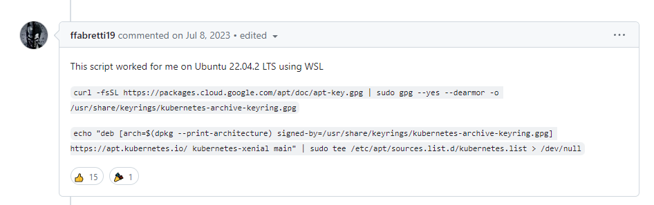

# Ubuntu 서버에 Kubernetes 설치


<details>
<summary> <b>Kubernetes(k8s)란 무엇이고 왜 사용하는 건가요?</b> </summary><br>

!!!! 쿠버네티스를 이해하기 전에 먼저 컨테이너 환경에 대해 이해가 필요합니다.<br>
컨테이너, Docker에 대해 모르신다면 [여기를 클릭하여 Docker 개념을 확인해주세요.](./Docker/README.md) !!!!


쿠버네티스는 컨테이너화된 애플리케이션을 자동으로 배포, 스케일링 및 관리해주는 오픈소스 시스템입니다.


컨테이너화 된 애플리케이션이 정말 많다고 가정했을 때 이들을 일일히 관리해야하면 얼마나 불편할까요?<br>
예로 만약 수많은 컨테이너 중 어떤 컨테이너가 다운되어서 이를 해결하기 위해 다른 컨테이너를 다시 시작해야하는 문제가 발생했을 때 직접 이 문제를 파악하고 처리하는 것보다 시스템이 처리해준다면 훨씬 수월하지 않을까요?

쿠버네티스 공식 사이트에서는 위와 같은 이유로 쿠버네티스가 필요하다고 합니다!<br>
많은 컨테이너들을 자동으로 배포, 확장, 관리하는 프로세스를 컨테이너 오케스트레이션이라고 부르며 k8s는 대표적인 컨테이너 오케스트레이션 툴입니다

쿠버네티스는 다음과 같은 기능들을 제공하면서 더욱 탄력적이게 분산 시스템을 실행할 수 있게 도와줍니다.<br>

- <b>서비스 디스커버리와 로드 밸런싱</b> 쿠버네티스는 DNS 이름을 사용하거나 자체 IP 주소를 사용하여 컨테이너를 노출할 수 있다. 컨테이너에 대한 트래픽이 많으면, 쿠버네티스는 네트워크 트래픽을 로드밸런싱하고 배포하여 배포가 안정적으로 이루어질 수 있다.
  
- <b>스토리지 오케스트레이션</b> 쿠버네티스를 사용하면 로컬 저장소, 공용 클라우드 공급자 등과 같이 원하는 저장소 시스템을 자동으로 탑재할 수 있다
  
- <b>자동화된 롤아웃과 롤백</b> 쿠버네티스를 사용하여 배포된 컨테이너의 원하는 상태를 서술할 수 있으며 현재 상태를 원하는 상태로 설정한 속도에 따라 변경할 수 있다. 예를 들어 쿠버네티스를 자동화해서 배포용 새 컨테이너를 만들고, 기존 컨테이너를 제거하고, 모든 리소스를 새 컨테이너에 적용할 수 있다.
  
- <b>자동화된 빈 패킹(bin packing)</b> 컨테이너화된 작업을 실행하는데 사용할 수 있는 쿠버네티스 클러스터 노드를 제공한다. 각 컨테이너가 필요로 하는 CPU와 메모리(RAM)를 쿠버네티스에게 지시한다. 쿠버네티스는 컨테이너를 노드에 맞추어서 리소스를 가장 잘 사용할 수 있도록 해준다.
  
- <b>자동화된 복구(self-healing)</b> 쿠버네티스는 실패한 컨테이너를 다시 시작하고, 컨테이너를 교체하며, '사용자 정의 상태 검사'에 응답하지 않는 컨테이너를 죽이고, 서비스 준비가 끝날 때까지 그러한 과정을 클라이언트에 보여주지 않는다.
  
- <b>시크릿과 구성 관리</b> 쿠버네티스를 사용하면 암호, OAuth 토큰 및 SSH 키와 같은 중요한 정보를 저장하고 관리할 수 있다. 컨테이너 이미지를 재구성하지 않고 스택 구성에 시크릿을 노출하지 않고도 시크릿 및 애플리케이션 구성을 배포 및 업데이트할 수 있다.


여담으로 Kubernetes를 k8s라고 부르는 이유는 'K'와 's'사이에 8문자(ubernete)가 있기 때문에 줄여서 k8s입니다.

더욱 자세한 설명은 쿠버네티스 공식 문서인 다음 사이트를 참고하시면 되겠습니다.<br>
https://kubernetes.io/ko/docs/concepts/overview/

</details>

### Kubernetes 구성


### Kubernetes 설치 방법

공식 사이트를 기준으로 설치방법을 배워보겠습니다.<br>
https://kubernetes.io/ko/docs/tasks/tools/<br>

먼저 kubectl을 설치해야합니다. 크게 아래와 같이 3가지 방법이 있는데
1. 리눅스에서 curl을 사용하여 kubectl 바이너리 설치
2. 기본 패키지 관리 도구를 사용하여 설치
3. 다른 패키지 관리 도구를 사용하여 설치

저의 경우 2번을 기준으로 Debian 계열의 기본 패키지인 apt를 이용한 kuberctl 설치를 진행하겠습니다.

apt 패키지 인덱스를 업데이트하고 쿠버네티스 apt 리포지터리를 사용하는 데 필요한 패키지들을 설치.
```
sudo apt-get update
sudo apt-get install -y apt-transport-https ca-certificates curl
```

@@@@ <b>Debian 9(stretch) 또는 그 이전 버전을 사용하는 경우 apt-transport-https도 설치.</b> @@@@
```
sudo apt-get install -y apt-transport-https
```

구글 클라우드 공개 서명 키를 다운로드

```
sudo curl -fsSLo /etc/apt/keyrings/kubernetes-archive-keyring.gpg https://packages.cloud.google.com/apt/doc/apt-key.gpg
```

쿠버네티스 apt 리포지터리를 추가한다.
```
echo "deb [signed-by=/etc/apt/keyrings/kubernetes-archive-keyring.gpg] https://apt.kubernetes.io/ kubernetes-xenial main" | sudo tee /etc/apt/sources.list.d/kubernetes.list
```

새 리포지터리의 apt 패키지 인덱스를 업데이트하고 kubectl을 설치.
```
sudo apt-get update
sudo apt-get install -y kubectl
```

### 문제가 발생하는 경우

저의 경우 Ubunut 22.04.3 LTS에서 다음과 같은 문제가 발생했습니다.

```
...(위의 내용 생략)
W: GPG 오류: https://packages.cloud.google.com/apt kubernetes-xenial InRelease: 다음 서명들은 공개키가 없기 때문에 인증할 수 없습니다: NO_PUBKEY B53DC80D13EDEF05
E: The repository 'https://apt.kubernetes.io kubernetes-xenial InRelease' is not signed.
N: Updating from such a repository can't be done securely, and is therefore disabled by default.
N: See apt-secure(8) manpage for repository creation and user configuration details.
```

이 문제를 해결하는 방법을 github issue에서 찾았는데 다음과 같았습니다.

<br>


위의 설치 과정에서 
"구글 클라우드 공개 서명 키를 다운로드"의 경우 아래 명령어를 실행시키고
```
curl -fsSL https://packages.cloud.google.com/apt/doc/apt-key.gpg | sudo gpg --yes --dearmor -o /usr/share/keyrings/kubernetes-archive-keyring.gpg
```

"쿠버네티스 apt 리포지터리를 추가 " 부분에서는 아래 명령어를 수행시켜주시면 됩니다.
```
echo "deb [arch=$(dpkg --print-architecture) signed-by=/usr/share/keyrings/kubernetes-archive-keyring.gpg] https://apt.kubernetes.io/ kubernetes-xenial main" | sudo tee /etc/apt/sources.list.d/kubernetes.list > /dev/null
```

위 두개의 명령을 수행하고 apt update 및 설치를 진행하자 설치가 정상적으로 수행되었습니다.