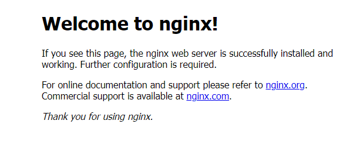

# Ubuntu에 WS (Nginx) 설치

<details>
<summary> 웹 서버 (WS)와 웹 어플리케이션 서버(WAS)란 무엇인가요?? </summary>

## 웹 서버 (Web Server / WS)
웹 서버는 클라이언트로부터의 요청을 받아들이고, 해당 요청에 대한 응답을 생성하여 전송하는 소프트웨어입니다. 간단하게 말하면, 웹 서버는 웹 페이지, 이미지, 비디오 등의 정적 또는 동적 콘텐츠를 클라이언트(웹 브라우저)에게 제공하는 역할을 합니다.

웹 서버는 HTTP(하이퍼텍스트 전송 프로토콜)를 사용하여 클라이언트와 통신하며, 사용자의 웹 브라우저에서 입력한 URL을 기반으로 요청을 처리합니다

일반적으로는 html, css, image, js 등등의 정적인 데이터를 바로바로 제공하지만 새롭게 생성되거나 입력 받은 데이터를 기반으로 가공된 데이터를 제공하기 위해서는 <b>웹 어플리케이션 서버 (WAS)</b>에 요청하고 결과를 받아서 보여주는 역할을 수행합니다.

## 웹 어플리케이션 서버 (Web Application Server / WAS)

WAS(웹 어플리케이션 서버)는 HTTP를 통해 어플리케이션을 수행해주는 미들웨어 입니다.

WS의 경우 자체적으로는 정적인 데이터만을 제공할 수 있습니다. 하지만 저희가 인터넷을 통해서 어떤 서비스를 이용할 때 보통은 단순 데이터만을 받기 위해서는 아닙니다.<br>
입력값에 따른 동적인 데이터의 생성, 데이터베이스 연동 등의 활동을 수행할 수 있도록 웹에서 어플리케이션이 수행 될 수 있도록 서비스를 제공하는 것이 WAS 입니다.

</details><br>

<details>
<summary>Nginx란 무엇이고 왜 쓰는 것일까요?</summary>

    Nginx는 가볍고 높은 성능을 제공하는 오픈 소스 웹 서버(WS)입니다.

    대표적인 WS로는 많은 분들이 알다시피 Apache가 있습니다. Apache는 1995년에 만들어져 역사가 긴 만큼 관련된 서적도 많이 존재하고 현재도 많은 사람이 이용하고 있습니다. 
    
    다만 Apache는 오래된 만큼 멀티 프로세스, 멀티 스레드의 전통적인 아키텍처을 지니고 있습니다.
    이로 인해 필연적으로 메모리 사용량이 현대의 웹 서버보다 상대적으로 높습니다.<br>

    이에 반해 Nginx는 2004에 등장한 WS로 이벤트 기반 아키텍처를 지니고 있습니다.<br>
    비동기식 처리 방식으로 빠른 성능과 적은 메모리 사용량을 제공하기 때문에 꾸준히 점유율이 높여온 WS입니다.

    이와 같이 Nginx는 강점으로 빠르고 메모리 사용량이 적다는 강점이 있기 때문에 프로젝트 시 Nginx를 WS로 채택하고 있습니다.
</details>

### Ubuntu에 Nginx 설치

#### Nginx 설치

```
sudo apt install nginx
```

#### Nginx 상태 확인

```
systemctl status nginx
```
<br>

명령어 결과 상태 확인 :<br>
<br>


정상 작동 중 서버 접속 시 화면 : <br>
<br>


#### nginx 설정 명령어
```
// nginx 시작
sudo ststemctl start nginx

// nginx 중지
sudo ststemctl stop nginx

// nginx 재시작
sudo ststemctl restart nginx

// nginx 완전 삭제
sudo apt-get remove --purge nginx nginx-full nginx-common
```

#### Certbot을 이용한 HTTPS 설정

<details>
<summary>HTTPS랑 Certbot이란??</summary>

## HTTPS
HTTPS란 클라이언트와 서버 간의 데이터를 주고 받는 규약 HTTP(Hyper Text Tranfer Protocol)에 Security(보안)를 더한 것 입니다.

기존 HTTP는 평문으로 데이터를 전송하기 때문에 데이터를 중간에 가로채게 되면 내용이 쉽게 노출되는 단점을 가지고 있었습니다.<br>

HTTPS는 데이터를 암호화하여 중간에 가로채더라도 읽을 수 없도록 지원하고 있습니다.<br>

기존의 HTTP의 경우는 80번 포트를 사용하는데 HTTPS 433번 포트를 사용합니다.

## Certbot
Certbot이란 무료로 SSL/TLS 인증서를 제공하는 Let's Encrypt의 인증서를 발급받고 자동으로 갱신하는 무료 오픈 소스 소프트웨어 입니다.<br>

Certbot을 몰랐을 때는 HTTPS 설정을 위해 SSL 인증서를 만들거나 찾고 개인키와 파일 경로를 설정하는 등등의 일련의 과정을 직접 수행해야했습니다.<br>
Certbot은 이러한 일련의 과정을 자동으로 수행하여 사용자가 더욱 간편하게 HTTPS를 설정할 수 있습니다.

더욱 자세한 설명과 설치 방법들은 아래의 공식 사이트에서 확인하실 수 있습니다.<br>
https://certbot.eff.org/

</details><br>

공식 사이트에서는 snap을 기준으로 하기 때문에 snap을 우선 설치해야합니다.<br>
apt, yum, dnf는 다른 방법으로 설치를 진행하셔야합니다.
### snap 설치 명령

```
sudo apt update
sudo apt install snapd
```

### Cerbot 설치 명령
```
sudo snap install --classic certbot
```

### Certbot 준비(Prepare)
Certbot이 확실히 동작할 수 있게끔 아래의 명령어를 실행시켜줍니다.
```
sudo ln -s /snap/bin/certbot /usr/bin/certbot
```

### Certbot 작동하기 OR 인증서만 가져오기

#### Certbot을 작동시켜 Nginx를 HTTPS 접근으로 자동 설정해주는 명령어
```
sudo certbot --nginx
```
<br>
명령어 수행 하면 이메일 입력, 조항 및 정보 수집의 동의 여부, DNS 입력 요구에 맞게 입력하시면 됩니다.<br><br>

참고로!<br>
DNS 입력시 혹시 iptime.org로 등록하시려고 하신다면 아마 CAA 문제로 등록이 불가능할 것입니다.
그 이유는 하나의 도메인에 대해서 기간당 요청 제한이 있다고 합니다. 그런데 iptime은 워낙 많은 한국 사람들이 요청을 하다보니 막히는 경우가 많다고 합니다. 이럴 땐 iptime이 아닌 다른 무료 혹은 유료 도메인으로 시도하시면 될 것 같습니다.


#### Certbot을 이용하여 인증서만 가져오는(나머지 설정은 직접 수행해야함) 명령어
```
sudo certbot certonly --nginx
```

특별한 문제가 없다면 certbot을 이용하여 https가 적용된 모습을 확인하실 수 있습니다!

