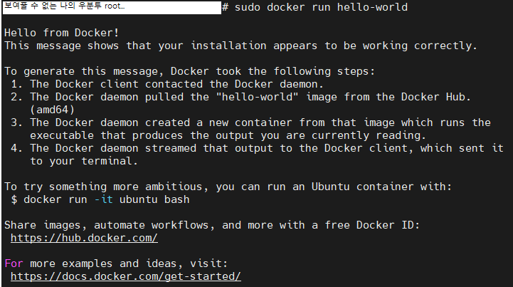

# Ubuntu 데스크탑을 이용한 서버 세팅

### Ubuntu 설치

VM, 실제 서버, 서버로 사용할 데스크탑 어디에도 적용이 가능하다. 아무튼 ubuntu OS로 설치를 한다.

Ubuntu 설치는 아래 링크
https://ubuntu.com/download/server

    Ubuntu Desktop VS Ubuntu Server
    
    우분투를 설치하려고 하면 크게 데스크탑과 서버 두가지 선택지가 있다.
    이 둘은 기본적으로 동일하나 결정적인 차이는 GUI를 제공하느냐 차이다.

    마치 개인 컴퓨터처럼 웹 서핑도 하고 이미지 작업도 하고 노래를 듣거나 기타 개인 컴퓨터의 기능도 수행하려면 Ubuntu Desktop이 적합하다.
    
    Server는 GUI가 제공되지 않고 데스크탑보다 서버 역할에 충실하기 때문에 서버 관련 기능들만 초기에 구비하고 있다. 그러다보니 초기 세팅 용량이 데스크탑보다 더 가벼워서 서버 구축에만 더욱 집중할 수 있다.

    위와 같은 차이를 지니고 있기 때문에 각자의 의도에 맞게 선택하면 된다.

만약 실제 하드웨어를 가진 기기에 OS를 설치한다면 아래에 부팅 가능한 usb 드라이버를 다운 받는다. 
https://rufus.ie/ko/
  
Rufus를 이용하면 다음과 같이 사용할 USB를 선택하여 
 
 ubuntu 이미지를 선택한 후 시작 버튼을 눌러주면 만들 수 있다. 
 
 

### SSH 연결

처음 설치가 완료되면 분명 유저 계정을 하나 만들었을 것이다. 
그 계정의 이름과 비밀번호를 기억해두자.

SSH 클라이언트로 ubuntu에 연결하려면 해당 ip를 입력하고 ubuntu에서 생성한 계정 이름과 비밀번호를 입력하여 접속하자.

    같은 공유기를 사용하고 있다면?

    예를들어 현재 한 iptime 공유기에 랜선이 두개로 하나는 작업용 PC, 하나는 Ubunut 서버에 연결되었다고 가정하면 공유기 내부에서 192.168.0.XXX 형태의 내부 ip를 사용할 것이다.

    작업용 PC에서 Ubunut에 연결하는 방법은 Ubunut 서버의 내부 IP가 192.168.0.1이라고 하면 192.168.0.1을 입력해도 연결이 가능하다.

    하지만 아예 외부에서 ssh로 연결하기 위해서는 기본 IP값에 포트포워딩을 통하여 Ubunut에 연결하게 해줘야한다.

    예를들어 원래 아이피가 XXX.YYY.ZZZ.ABC라면 XXX.YYY.ZZZ.ABC:12345 포트에 연결하겠다고 하면 이 값은 192.168.0.1로 연결시키는 설정이 필요하다.

### Docker 설치

Docker의 개념을 모른다면 추천하는 개념 설명은 아래 사이트를 읽어보시면 좋습니다. 
https://docs.docker.com/guides/get-started/ 
https://www.ibm.com/kr-ko/topics/docker 
https://aws.amazon.com/ko/docker/

굉장히 쉽게 정리하면 아주 예전에는 한 서버, 하나의 물리적인 시스템에는 하나의 서비스만을 제공할 수 있었습니다. 
그러나 매우 간단한 서비스를 제공해야한다면 CPU 사용률, 자원의 사용률에 낭비가 발생합니다. 

돈을 들여서 서버를 장만했는데 "Hello World" 딱 하나 보여주는 웹 사이트용으로만 사용하면 매우 낭비지 않겠나요?

그래서 이를 해결하기 위해 하나의 물리적 시스템이 여러 OS를 실행할 수 있는 가상 머신(VM)이 나오게 됩니다. 
하지만 VM의 경우 호스트 OS 위에 가상화된 OS를 두게 되는데 당연히 OS 이미지는 무겁고 느리다는 단점이 존재합니다.

#### 그래서 나온 것이 컨테이너(container)를 실행하고 관리하는 오픈 소스 가상화 플랫폼 Docker 입니다.

컨테이너란 격리된 환경의 코드를 뜻합니다. 컨테이너는 여러분의 OS와 파일 등에 대해 전혀 알지 못합니다. 
또한 호스트 OS의 커널을 공유하고 있습니다. 
VM의 경우 OS가 완전 분리되지만 컨테이너는 Docke 위에 어플리케이션 실행을 위한 이미지만이 올라갑니다. 

이미지는 컨테이너를 실행할 수 있는 파일과 설정 모음입니다. 
만약 MySQL 이미지를 한 컨테이너에 넣고 다른 곳에 SpringBoot를 넣었다면 각각의 컨테이너는 SpringBoot, Mysql로 동작하게 됩니다. 

위의 내용이 아주 간략하게 정리한 내용이고 자세한 내용은 위의 사이트들을 참고하면 됩니다.

    Docker를 설치해보도록 합시다.
    
    ubuntu 기준으로는 아래에 공식사이트에서 실행시켜야할 명령들을 제공합니다.
    https://docs.docker.com/engine/install/ubuntu/

    1. 먼저 도커 레포지터리를 세팅해야합니다. 이유는 추후 docker install, update를 레포지터리에서 수행 가능하게 되기 때문이라고 합니다.

    아래의 명령들을 위에서부터 차례대로 수행해줍니다.

    # Add Docker's official GPG key (아래는 도커 공식 GPG key 추가하는 코드들):
    sudo apt-get update
    sudo apt-get install ca-certificates curl gnupg
    sudo install -m 0755 -d /etc/apt/keyrings
    curl -fsSL https://download.docker.com/linux/ubuntu/gpg | sudo gpg --dearmor -o /etc/apt/keyrings/docker.gpg
    sudo chmod a+r /etc/apt/keyrings/docker.gpg

    # Add the repository to Apt sources (레포지터리를 apt 소스에 추가하는 코드들):
    echo \
    "deb [arch=$(dpkg --print-architecture) signed-by=/etc/apt/keyrings/docker.gpg] https://download.docker.com/linux/ubuntu \
    $(. /etc/os-release && echo "$VERSION_CODENAME") stable" | \
    sudo tee /etc/apt/sources.list.d/docker.list > /dev/null
    sudo apt-get update

    2. docker pakage를 install합니다.
    
    sudo apt-get install docker-ce docker-ce-cli containerd.io docker-buildx-plugin docker-compose-plugin

    3. docker engine이 제대로 설치되었는지 hello-world 이미지를 실행하여 확인해봅니다.

    sudo docker run hello-world

정상적으로 설치하고 3번을 수행하면 결과는 다음과 같습니다.  
 