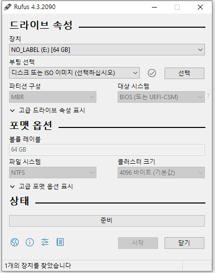
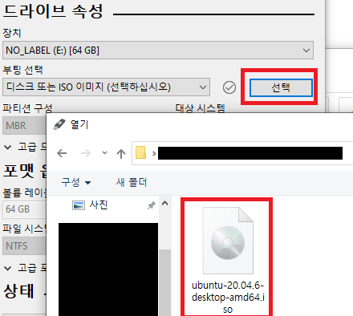

# Ubuntu 데스크탑을 이용한 서버 세팅

### Ubuntu 설치

VM, 실제 서버, 서버로 사용할 데스크탑 어디에도 적용이 가능하다. 아무튼 ubuntu OS로 설치를 한다.

Ubuntu 설치는 아래 링크
https://ubuntu.com/download/server

    Ubuntu Desktop VS Ubuntu Server
    
    우분투를 설치하려고 하면 크게 데스크탑과 서버 두가지 선택지가 있다.
    이 둘은 기본적으로 동일하나 결정적인 차이는 GUI를 제공하느냐 차이다.

    마치 개인 컴퓨터처럼 웹 서핑도 하고 이미지 작업도 하고 노래를 듣거나 기타 개인 컴퓨터의 기능도 수행하려면 Ubuntu Desktop이 적합하다.
    
    Server는 GUI가 제공되지 않고 데스크탑보다 서버 역할에 충실하기 때문에 서버 관련 기능들만 초기에 구비하고 있다. 그러다보니 초기 세팅 용량이 데스크탑보다 더 가벼워서 서버 구축에만 더욱 집중할 수 있다.

    위와 같은 차이를 지니고 있기 때문에 각자의 의도에 맞게 선택하면 된다.

만약 실제 하드웨어를 가진 기기에 OS를 설치한다면 아래에 부팅 가능한 usb 드라이버를 다운 받는다. 
https://rufus.ie/ko/
  
Rufus를 이용하면 다음과 같이 사용할 USB를 선택하여 
 
 ubuntu 이미지를 선택한 후 시작 버튼을 눌러주면 만들 수 있다. 
 
 

### SSH 연결

처음 설치가 완료되면 분명 유저 계정을 하나 만들었을 것이다. 
그 계정의 이름과 비밀번호를 기억해두자.

SSH 클라이언트로 ubuntu에 연결하려면 해당 ip를 입력하고 ubuntu에서 생성한 계정 이름과 비밀번호를 입력하여 접속하자.

    같은 공유기를 사용하고 있다면?

    예를들어 현재 한 iptime 공유기에 랜선이 두개로 하나는 작업용 PC, 하나는 Ubunut 서버에 연결되었다고 가정하면 공유기 내부에서 192.168.0.XXX 형태의 내부 ip를 사용할 것이다.

    작업용 PC에서 Ubunut에 연결하는 방법은 Ubunut 서버의 내부 IP가 192.168.0.1이라고 하면 192.168.0.1을 입력해도 연결이 가능하다.

    하지만 아예 외부에서 ssh로 연결하기 위해서는 기본 IP값에 포트포워딩을 통하여 Ubunut에 연결하게 해줘야한다.

    예를들어 원래 아이피가 XXX.YYY.ZZZ.ABC라면 XXX.YYY.ZZZ.ABC:12345 포트에 연결하겠다고 하면 이 값은 192.168.0.1로 연결시키는 설정이 필요하다.