# Ubuntu 데스크탑을 이용한 서버 세팅

### Ubuntu 설치

VM, 서버용 하드웨어, 서버로 사용할 데스크탑 어디에도 적용이 가능합니다.

Ubuntu 설치는 아래 링크
https://ubuntu.com/download/server

    Ubuntu Desktop VS Ubuntu Server
    
    우분투는 Ubuntu Desktop과 Ubuntu Server 두 가지 선택지가 있습니다.
    이 둘은 근본적으로 제공하는 기능이 동일하나 결정적인 차이는 GUI를 제공하느냐의 차이가 있습니다.

    개인 컴퓨터처럼 웹 서핑도 하고 이미지 작업도 하고 노래도 듣고 기타 개인 컴퓨터의 기능도 수행하고 싶다면 Ubuntu Desktop이 적합합니다.
    
    Ubuntu Server는 GUI가 제공되지 않고 데스크탑보다 서버 역할에 충실하기 때문에 서버 관련 기능들만 구비하고 있습니다. 서버에만 집중되어 기능을 제공하기 때문에 데스크탑과 같이 서버에 불필요한 기능을 제공하지 않아 더 가볍고 서버 구축에 더욱 집중할 수 있습니다.

    위와 같은 차이를 지니고 있기 때문에 각자의 사용할 의도에 맞게 선택하면 됩니다.
    (저는 웹 서핑, 이미지 확인 등도 같이 하기 때문에 Desktop을 선택했습니다.)

만약 실제 하드웨어를 가진 기기에 OS를 설치한다면 아래에 부팅 가능한 usb 드라이버가 필요합니다.<br>

### Rufus를 이용한 설치

아래 사이트는 usb를 부팅 가능한 USB로 만들어주는 Rufus를 다운 받을 수 있는 공식 사이트 입니다.<br>
https://rufus.ie/ko/
<br><br>
Rufus를 이용하면 다음과 같이 사용할 USB를 선택하여<br>
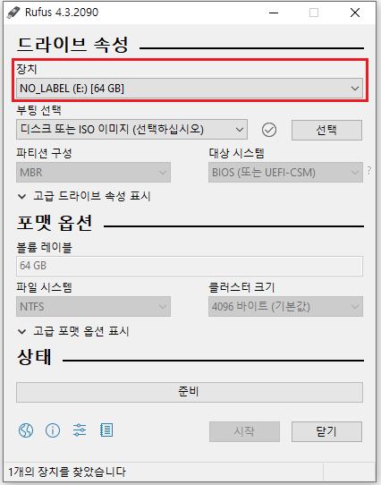<br>
<br>ubuntu 이미지를 선택한 후 시작 버튼을 눌러주면 만들 수 있습니다.<br>
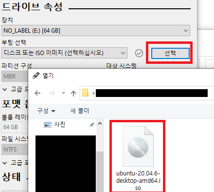<br>
<br>

VM의 경우는 각 VM에 맞는 설치법 대로 Ubunut 이미지를 마운트하여 설치하면 됩니다.<br> 
데스크탑 같은 하드웨어에 설치하기 위해서 부팅을 설치 USB가 실행되게 만들어서 설치해주면 됩니다.<br>

"/casper/vmlinuz.efi : file not found" 오류가 발생하면 다음 방법을 따라해보세요

### Universal USB Installer를 이용한 설치

Rufus로 설치 시 가끔 아래와 같은 오류가 발생하여 설치가 안될 때가 있습니다.
 "/casper/vmlinuz.efi : file not found"

해당 문제 발생 시 다른 부팅 USB 프로그램인 Universal USB Installer를 이용하시면 됩니다.

아래는 공식 사이트로<br>
https://pendrivelinux.com/universal-usb-installer-easy-as-1-2-3/#UUI-Download<br>

여기서 스크롤을 내리면 UUI 다운로드 버튼이 있습니다.

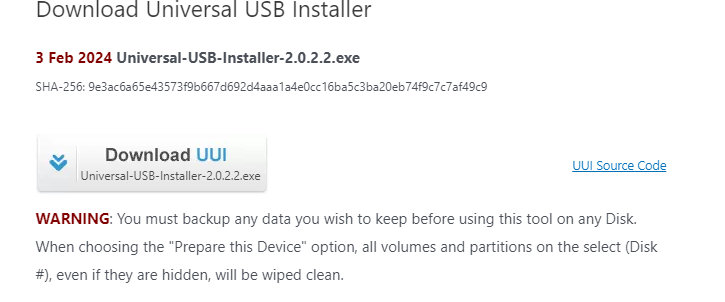

해당 버튼을 눌러서 다운받은 후 설치한 exe 파일을 실행하면

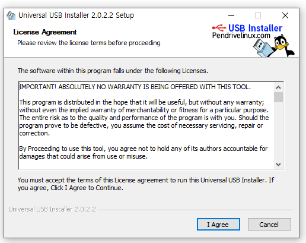

동의 버튼을 누르고

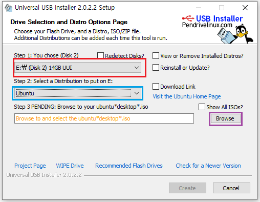

1. 빨간색 버튼으로 부팅 USB로 만들 USB를 선택해주시고
2. 파란색에서 설치할 OS를 선택해주시고
3. 보라색으로 OS의 이미지 파일을 선택해주시면 됩니다.
4. 그리고 create 버튼을 누르면 완료입니다.


### SSH 연결

SSH에 연결하려면 우선 openssh-server를 설치하셔야합니다. ubuntu에서 아래의 커맨드를 입력하여 필요한 기능들을 설치해봅시다.

```
일반 계정의 경우
$ sudo apt update
$ sudo apt-get install openssh-server

root 계정일 경우
# apt update
# apt-get install openssh-server
```

이렇게하면 ssh 연결이 가능한 상태가 되었습니다.<br>
SSH 클라이언트로 ubuntu에 연결하려면 ubuntu의 ip를 입력하고 계정 이름과 비밀번호를 입력하면 접속할 수 있습니다.

여러가지 SSH 클라이언트가 있지만 현재 제가 사용하는 툴은 MobaXterm인데 그것을 기준으로 연결을 시도해보겠습니다.

참고로 MobaXterm은 공식사이트인 https://mobaxterm.mobatek.net/ 에서 설치하실 수 있습니다.

우선 설치한 MobaXterm을 키고 Session 탭을 클릭해주세요
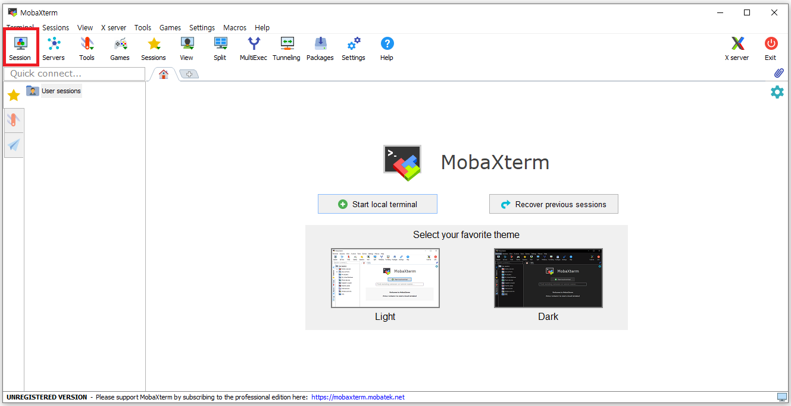

이후 SSH 탭에서 빨간 표시된 부분에 해당하는 입력값을 넣어주시고 OK버튼을 누릅니다.
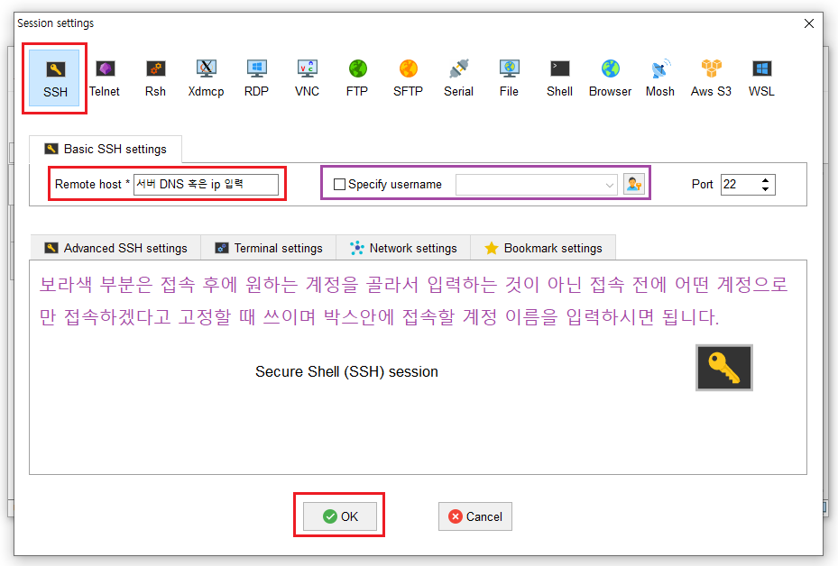

    만약 같은 공유기를 사용하고 있다면?

    예를 들면 현재 한 Iptime 공유기에 랜선을 두개 꽂아서 하나는 작업용 PC, 하나는 Ubunut 서버에 연결되었다면 각각의 IP는 192.168.0.XXX 형태의 사설 IP일 것입니다.

    같은 공유기를 쓰는 작업용 PC에서 Ubunut에 연결하는 방법은 Ubunut 서버의 IP가 192.168.0.156이라고 하면 ip입력 란에 192.168.0.156을 입력해도 연결이 가능합니다.

    하지만 아예 외부에서 ssh로 연결하기 위해서는 공인 IP값에 포트포워딩을 통하여 Ubunut에 연결하게 해줘야합니다.

    예를들어 원래 아이피가 XXX.YYY.ZZZ.ABC라면 포트포워딩으로 XXX.YYY.ZZZ.ABC:'특정 포트 번호'로 요청이 들어오면 사설 IP인 192.168.0.156로 연결시키는 설정이 필요합니다.

ssh로 연결이 됐다면 계정 이름과 비밀번호를 입력해줍시다.<br>

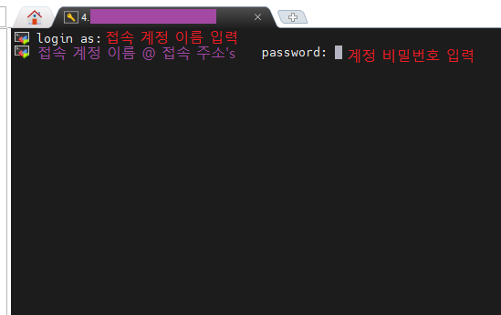

그러면 계정 이름과 비밀번호를 정확히 입력했다면 연결이 정상적으로 완료됩니다.

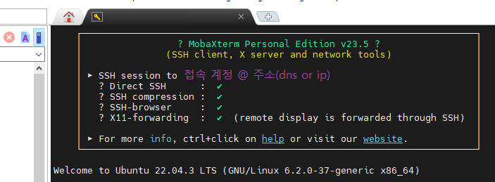

### SSH root로 바로 연결하기

Ubuntu는 기본적으로 root으로 다이렉트 접속을 막아놓았습니다. 그렇기 때문에 root으로 바로 접속하려면 따로 설정이 필요합니다.

먼저 아래 명령어를 입력하고 비밀번호를 입력하여 root 계정을 활성화시켜주세요
```
sudo password root
```

ssh root 접근은 sshd_config 파일의 내용을 직접 수정하여 root 접근을 허용해야합니다. 아래 명령어를 입력해주세요.

```
# vim /etc/ssh/sshd_config
```

해당 명령을 수행하면 sshd_config 파일의 내용이 나오면 /PermitRootLogin을 입력해주세요. (슬래쉬는 찾기 기능입니다.)<br>

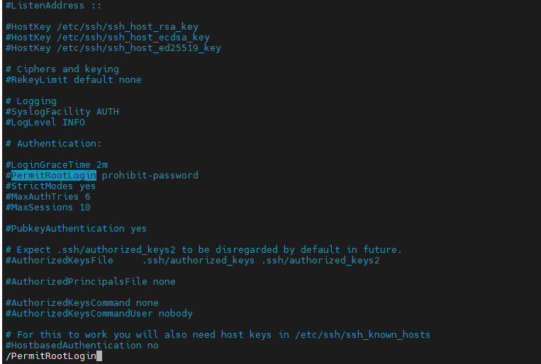

여기서 앞에 #을 때서 주석을 해제하고 뒤에 prohibit 이하 부분을 yes로 수정해주세요.

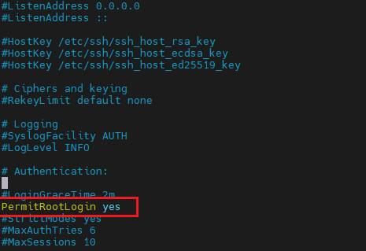

해당 설정들을 마치셨으면 ssh 접속 시 다이렉트로 root 로그인이 허용된 것을 확인하실 수 있습니다.